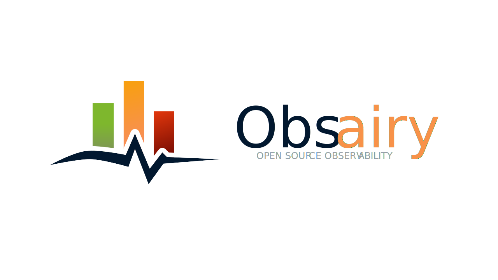
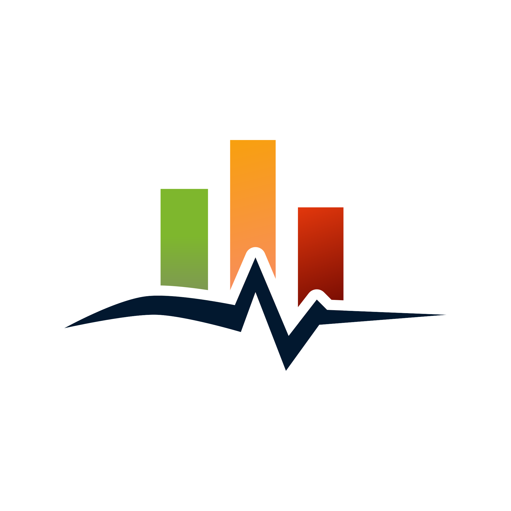

<table>
  <tr>
    <td width="150">
      
    </td>
    <td>
      <h1>Obsairy</h1>
      
<strong>Clear, open, and effortless observability.</strong>

      

        Obsairy is an open-source observability platform built for modern engineering teams. Written in <strong>Golang</strong> (backend) and <strong>React + TypeScript</strong> (frontend), Obsairy focuses on performance, simplicity, and developer experience.
      

      

        It collects <strong>metrics, traces, and logs</strong> using multiple observability agents, with <a href="https://opentelemetry.io/">OpenTelemetry</a> as the default. Obsairy gives you unified, flexible visibility into your systems—fully open and under your control.
      

    </td>
  </tr>
</table>

---

## Contributing
Contributions are welcome! If you'd like to help improve Obsairy, please check out our [Contribution Guide](CONTRIBUTING.md).

## License
This project is licensed under the Apache 2.0 License - see the [LICENSE](LICENSE) file for details.